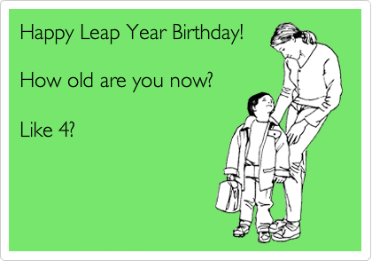

# Happy birthday to you


Your friend John is born February 29, 1980, which was a leap year.
In the gregorian calendar a leap year is a year containing one additional day
to keep the calendar synchronized with the astronomical year.
The sad thing about this is that John can't celebrate his birthday every year like the rest of us.
And, as we all know, the best is to celebrate a birthday in the weekend.

Given a date range, calculate how many birthdays fell on a friday or saturday for a person born February 29th.

## Input
Input is given as a date range in the following format:

DD MM YYYY - DD MM YYYY

## Output
For each date range, output how many 29th of february who fell on a friday or saturday.

## Constraints
* 0001 &le; _YEAR_ &le; 3000
* 01 &le; _DD_ &le; 31
* 01 &le; _MM_ &le; 12
* The date range is inclusive.
* The start and end dates are valid dates.

## Sample input
```
29 02 2008 - 12 12 2014
```

## Sample output
```
1
```
