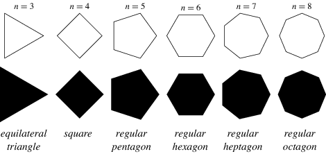

# Festival area


Arranging a festival is a lot of work. You have to book artists and
attractions, provide food, sell tickets etc. Another important aspect of
arranging a festival is to put up a fence around the festival area, to ensure
that everybody inside has bought a ticket.

Fences around festival areas consist of several straight fences attached
together at fence posts. This means that they form the shape of a (possibly
irregular) polygon. In general this can be any polygon (some of the fence posts
may even stand on a line), except that the fence will never cross itself.

For the festival planners to be able to calculate the number of tickets they
can sell, they must know the area of the festival area. Can you help them out?

## Input
The first line of input contains an integer _N_, the number of fence posts in
the fence.  

Then follows _N_ lines describing the fence posts. Line _i_ contains two
numbers _x_ and _y_, the coordinates (_x_, _y_) of fence post _i_. The fence
lines are ordered such that fence post _i_ is directly connected to fence post
_i + 1_ and _i - 1_. The last fence post is also connected to the first post.

## Output
Print the area of the festival area. Solutions with an absolute or relative
error less than 10<sup>-8</sup> will be accepted!

## Constraints
3 &le; _N_ &le; 10<sup>5</sup>
|_x_|, |_y_| &le; 10<sup>6</sup>

You can assume that the area is less than 10<sup>18</sup>

## Sample input 1
```
4
-1.0 1.0
1.0 1.0
1.0 -1.0
-1.0 -1.0
```

## Sample output 1
```
4.0
```

## Sample input 2
```
5
-4.0 9.0
1.0 5.0
6.0 1.0
-1.0 2.0
-3.0 -2.0
```

## Sample output 2
```
36.0
```
