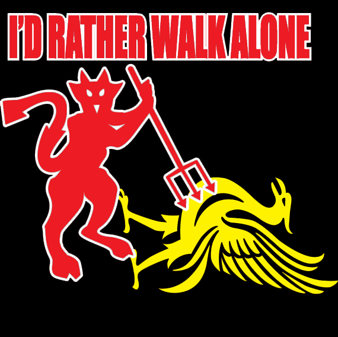

# I'd rather walk alone
 

One evening you're visiting your uncle, you find yourself exploring his dark basement. In a hidden drawer along some football cards you discover some old and almost unreadable hand written notes.
The title says season 1989/1990.
You examine the papers closely and discover numerous messages. "Liverpool before Manchester United" a message says. You are stunned.
You can't believe what you're reading. What could this mean? Could it be that Liverpool placed before Manchester United in the top division some time in the past?
You quickly decide to investigate by making a program to decipher these messages into a sorted table.

## Input
A list of league placement constraints between teams in the English top football division. A message consist of a constraint that a team places either somewhere after or before another team in the league.  Team names are given as one word, team names with space are concatenated to "teamName".
You can assume that all constraints given are valid and unique, so that a team can't be placed both before and after another team. You can also assume that for a set of constraints, there only exist one possible solution.

## Output
A sorted list where the team who places first in the league are printed first.

## Constraints
Number of teams in a league is always greater than 1 and less or equal to 20.

## Sample input
Liverpool BEFORE ManchesterUnited
Chelsea AFTER ManchesterUnited
Chelsea AFTER Liverpool

## Sample output
Liverpool
ManchesterUnited
Chelsea

