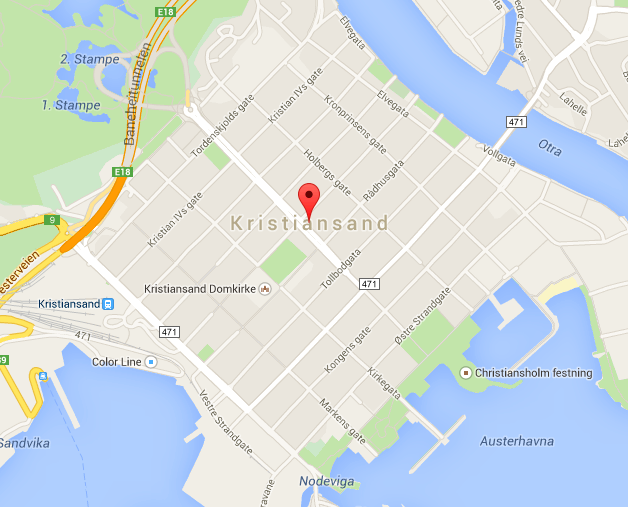

# Kristiansand road work


The city of Kristiansand was founded by Christian IV of Denmark-Norway in 1641.
In the interest of order, King Christian constructed the city as a quadrature,
such that the streets form a perfect regular grid. Since all blocks have the
same size, navigating Kristiansand is simple; as long as you never move in the
wrong direction along the x- or y-axis, you will follow a route which is as
short as possible.



As a result of this sweet layout, the inhabitants of Kristiansand have no idea
how to navigate a road network that is not a perfect grid. Lately this has
become a problem, as frequently some intersections are closed due to
maintenance.

Luckily, there is some order to the road work maintenance. The workers go home
in the evening, so each morning all the intersections are open. Each time
maintenance is started, authorities will dispatch a message stating which
intersection is affected. Authorities will also inform when the work is
finished.

Help the inhabitants of Kristiansand out by running a navigation service, which
can respond to calls from desperate citizens at any time and help them find the
shortest route from their current position to the place they need to go. In
order to do this you have to keep track of which intersections are closed by
listening to the messages coming in from city authorities.

## Input
The first line of input consists of three integers _X_, _Y_ and _M_, the height
and width of the city grid, and the number of messages you will receive.

Then follows _M_ messages. Each message begins with a codeword (either `OPENED`,
`CLOSED` or `REQUEST`).  

Messages beginning with `OPENED` or `CLOSED` contain
two integers _x_ and _y_, indicating that the intersection with coordinates
(_x_, _y_) has been opened/closed. These messages should not be answered.  

Messages beginning with `REQUEST` contain four integers _x<sub>1</sub>_,
_y<sub>1</sub>_, _x<sub>2</sub>_ and _y<sub>2</sub>_, denoting the current
location of the caller (_x<sub>1</sub>_, _y<sub>1</sub>_), and the location he
wants to go to (_x<sub>2</sub>_, _y<sub>2</sub>_), respectively.

## Output
For each `REQUEST`-message print a line containing a single integer denoting
the lowest number of blocks the caller has to go to get where wants.  If there
is no such route, simply output `STAY WHERE YOU ARE`.

## Constraints
<input size constraints here>

## Sample input
```
10 10 6
CLOSED 4 5
CLOSED 5 5
REQUEST 6 3 4 8
REQUEST 4 8 5 3
OPENED 5 5
REQUEST 5 3 4 8
```

## Sample output
```
7
8
6
```
