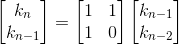
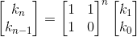

# The pinmaker 2
Input here is way too large for a linear algorithm to finish in time.

Iterating the difference equation one step can be done using matrix-notation
like this:

This can be generalized to _n_:

Matrix exponentiation can be done in O(log n) using [exponentiation by squaring](http://en.wikipedia.org/wiki/Exponentiation_by_squaring). Remember to do modulo 108 after all operations to avoid overflows.