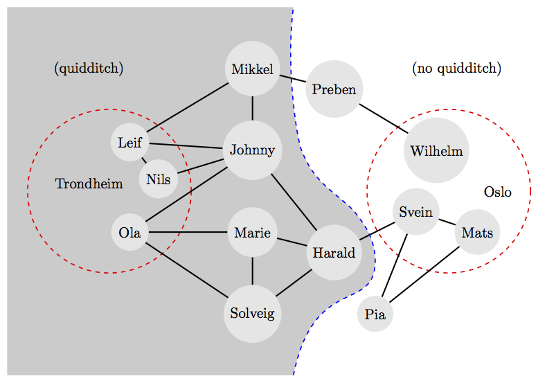

# Quidditch breakup


As every other norwegian highschool senior, Svein is in a class that is about
to be torn apart. The question on everybody's mind is of course: _Should i go
to UiO or NTNU_. Some of Svein's classmates have already decided where they
want to go, but some of them are still undecided.

The problem with NTNU is that students who begin there tend to start playing
quidditch (I shit you not). Therefore nobody going to UiO can remain friends
with anybody going to NTNU. As you can imagine, Svein is heartbroken by the
fact that the camaraderie of his class is going to be ruined by some of them
going to NTNU.

Luckily, he has acquired access to the Facebook accounts of all his classmates.
By carefully examining conversation logs and other data he has been able to
infer which of his friends who have already decided where they want to go.
Also, Svein has been able to construct a graph representing the various
friendships between his classmates. A visualized example of this data can be
seen in the figure below.



Svein wants to find the optimal configuration of students going to the two
universities, such that as few friendships as possible will have to be
terminated. In the example figure above you can see that Svein, Wilhelm and
Mats have decided to go to UiO, while Leif, Nils and Ola have decided to go to
NTNU.  The rest of Svein's classmates have not decided yet, and their
friendships are shown as edges in the graph. By sending the people in the gray
region to NTNU and the rest to UiO, only two friendships must be broken. This
is the optimal solution in the example above.

Given the data Svein has acquired about the friendship network, help him out
and find the minimum number of friendships that must be terminated in order for
each person in the network to start at either UiO or NTNU.

Note that Svein has great respect for other people's privacy. He has therefore
replaced each of the _n_ names with a number from _1_ to _n_ (inclusive) for
the sake of anonymity. You can also assume that no person has decided to go to
_both_ NTNU and UiO.

## Input
The first line of input contains four integers _n_, _o_, _t_ and _f_, the
number of people in the class, the number of people who have decided
to go to UiO, the number of people who have decided to go to NTNU, and
the number of friendships, respectively.

The next line contains _o_ integers, the IDs of the people who have decided to
go to Oslo, in no particluar order.

The next line contains _t_ integers, the IDs of the people who have decided to
go to Trondheim, in no particular order.

Then follows _e_ lines each containing two integers _a_ and _b_, indicating
that person with ID _a_ and person with ID _b_ are mutually friends. No
friendships occur twice and _a_ is always smaller than _b_, but other than
that the friendships come in no particular order.

All IDs are between _1_ and _n_, inclusive.

## Output
Output the minimum number of friendships that must be terminated.

## Constraints
2 &le; _n_ &le; 500  
0 &le; _o_, _t_, &le; _o_ + _t_ &le; _n_

## Sample input 1
```
2 1 1 1
1
2
1 2
```

## Sample output 1
```
1
```

## Sample input 2 (the figure above)
```
13 3 3 18
1 2 3
11 12 13
1 6
7 6
7 13
8 13
12 13
8 12
7 11
9 11
10 11
9 10
5 9
5 10
2 3
2 5
2 4
3 4
7 8
5 8
```

## Sample output 2
```
2
```
