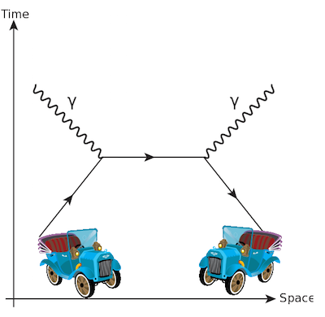

# Roundabout madness


Nobody knows why there seems to be so much more matter in the universe than
anti-matter. That does not matter for this problem, but you are a little
concerned for the traffic security in a roundabout nearby. The roundabout is
very large, which is really nice. The problem is that there is no general
agreement about which direction traffic should move around it. Even worse, it
seems that right-hand drivers and left-hand drivers are anti-drivers, which
means that they will annihilate each other if they collide. The annihilation
process will result in a short outburst of turn light which will not affect the
other drivers.

Given a configuration of cars, you'd like to know who will survive if the
drivers decide to drive around the roundabout until there's only one type of
driver left.

## Input
One string of characters either L or R signifying a driver on his way to the
left or right. The roundabout is cyclic.

## Output
One line of space separated integers denoting the positions of the surviving
drivers in the original string (0-indexed). The answer should be in ascending
order. If no drivers survive, output a line with the string `Too Bad` instead.

## Constraints
The string will contain between 1 and 100 000 characters.

## Sample input
```
LLLRLLR
```

## Sample output
```
1 2 5
```
