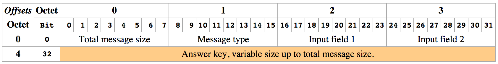

# Socketzz

Applications in 2014 often requeres to communicate with either servers, or 
other clients. An importent aspect of this communication is a well defined
protocol so the messages passed are understood correctly by any parties.

In this task you must be able to send two inputs to our server via our defined
protocol. The server will reply with a key that can vary up to the total message
size. (2^8 bytes).

In this task we have prepaired a server running on port 3950 at vor.ifi.uio.no.
you can use this when you are testing, but when you deliver you must make
sure that your client is connecting to 172.62.248.162 at port 3950.

## Input
Input is two integerns with newlines separating them.

## Output
Your program should output the key you got from the server.

## Constraints

Our server is using the protocol described here. It is important that you use 
the same length of all fields, and send then via network order endian if 
neasesary. 


## Sample input
```
12
4
```

## Sample output
```
15192330574732399779
```
