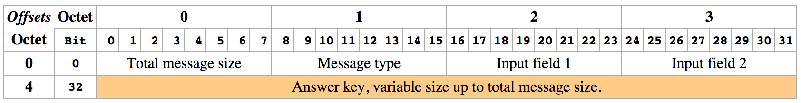

# Something, something network
Making applications in 2014 often requires to communicate with servers or other
clients. An important aspect of this communication is to have a well defined
protocol in order for messages to be understood correctly by all parties.

In this task you must be able to transmit two integers to our server using our
protocol. The server will reply with a key that can vary in length up to the
total message size (2^8 bytes).

Our server (IP 178.62.248.162) is running at port 3950. Feel free to use this
server for testing and for submission.

## Protocol
Our server protocol follows. It is important that you use the same length in
all fields, and send via network order endian if necessary.



    - Total message size: Number of bytes in message
    - Message type is defined as:
        - 0x02 - Request a key from server
        - 0x03 - Answer from server with key
    - Input field 1/2: numbers read from stdin

## Input
Input consists of two space separated integers.

## Output
Your program should output the key as received from the server.

## Sample input
```
4 4
```

## Sample output
```
15192330574732399515
```
