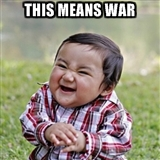

# War


Your son Mike is a really great kid but he loves to play the classic card game
war.  The problem is that he wants to play it with you.  You find the game a
bit boring since there are no choices in the game, given a sequence of cards in
a card deck it is always possible to calculate who the winner is going to be.
You quickly decide to code a program that given a sequence of cards, calculates
the course of a game of war. The program should output the player that won.

### The rules of war
War consists of rounds, where each round consists of the following steps:

1. Each player draws a card from the top of the stack and puts it on the table
    - The player with the higher card wins and collects all cards on the table, the round ends
2. If the cards are equal, the cards remain on the table, and the players draw three new cards from their stack and place them face down on the table
    - If a player doesn't have enough cards, he'll lose
    - If neither player has enough cards, the one who runs out first loses

- If the players run out of their cards at the same time it's a draw

When a player wins cards, they are placed on the bottom of the stack in this
order:

1. The player puts his own cards from the table _under_ his own stack, in the order they were put on the table
2. The player puts the opponents cards from the table in his own stack the same way

### Example
Your stack is `4, 1, 2, 3, 3, 8, 7` (`4` being the next card you will draw).

Mike's stack is `4, 3, 2, 1, 2`.

In the first round both you and Mike put down a `4`, making it a draw. Then you put three cards face down on the table each.

In the second round you put down a `3` and Mike put down a `2`, i.e. you win
the round.

Your stack is currently `8, 7` (`8` being the next card you will draw).

You put your own cards from the table (`4, 1, 2, 3, 3`) under your own stack in
the order they were put on the table, making the stack `8, 7, 4, 1, 2, 3, 3`.

You put Mike's cards from the table (`4, 3, 2, 1, 2`) in your own stack the same
way, making it `8, 7, 4, 1, 2, 3, 3, 4, 3, 2, 1, 2`.

Mike cannot start the next round because he has no cards to play, so you win the
game.

This game lasted two rounds.

### Your task
You are given your and Mike's stack as input, and your program should print the
name of the winner or call a draw. If the game goes on for 100 000 rounds or
more, you get tired and call it a draw.

## Input
The first two lines of input contains a single integer each, _n_ and _m_, which
are number of cards in your and Mike's stack, respectively.

Then follows a line with _n_ integers _c<sub>i</sub>_, each representing the
value of the cards in your stack, from top to bottom.

Then follows a line with _m_ integers _c<sub>i</sub>_, each representing the
value of the cards in Mike's stack, from top to bottom.

## Output
Output the result of the game; either `you`, `mike` or `draw`

## Constraints
0 &le; _n_, _m_ &le; 500  
0 &le; _c<sub>i</sub>_ &le; 10<sup>5</sup>  
Multiple cards may carry the same value c  
If there are 100 000 rounds or more, they call it a draw

## Sample input
```
3
3
2 3 1
1 2 3
```

## Sample gameplay
* Your stacks at the beginning: `2, 3, 1` and `1, 2, 3`
* You draw 2, Mike draws 1, you win
* `3, 1, 2, 1` and `2, 3`
* You draw 3, Mike draws 2, you win
* `1, 2, 1, 3, 2` and `3`
* You draw 1, Mike draws 3, Mike wins
* `2, 1, 3, 2` and `3, 1`
* You draw 2, Mike draws 3, Mike wins
* `1, 3, 2` and `1, 3, 2`
* You draw 1, Mike draws 1
* You try to draw three cards but your stack runs empty
* Mike tries to draw three cards, but his stack also runs empty
* It's a draw

## Sample output
```
draw
```

## Sample input
```
3
3
4 3 1
3 2 2
```

## Sample output
```
you
```
